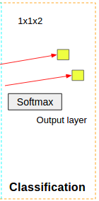

# Nature...Or Not?
I've trained a convolutional neural network to recognize the presence of man-made structures in satellite images from around the globe (and extra-terrestrial globes).

## Table of Contents
- [Motivation](#motivation)
- [Dataset](#dataset)
- [Pre-Processing](#pre-processing)
- [Architecture](#architecture)
- [Scores](#scores)
- [Fun Tests](#fun-tests)
- [Next Steps](#next-steps)

     

## Motivation
Viewing Earth from above can give us an amazing and very different perspective on the changes going on in the world. We can monitor land use, reconnoiter areas of conflict, and survey natural disaster areas to find the best ways to bring in assistance...and, in the future, explore new planets for signs of life.

     

## Dataset
I gleaned 6,700 images from Googlemaps, manually and using the Google API with some scripting.  The images in my training and test sets come from around the world and contain a variety of natural settings, including forests, rivers, mountains, deserts, beaches, and ice and snow.

The original collected images were quite large, 1152x864x3, which requires more memory than most GPUs can handle, so they were cut down to 124x124x3 using python's PIL library.

     

The labeling for these images was performed by hand, labeled 0 for images containing only nature and 1 for images containing any man-made object. I've included plowed fields as man-made objects, as the patterns rendered by the plow are more closely related to other man-made objects than to that of nature. And technically, these shapes are man-made.

I was able to augment the 6,700 labeled images by taking the 90, 180, and 270 degree rotations of the image, as well as creating mirror images of these 4 rotations.  This created 8 total sets of usable data, for a total of 53,600 images.

     

## Pre-Processing
The feature (X) values in my dataset are the RGB values of the pixels.  Thus, X is a 124x124x3 array of RGB pixel values.

The data was broken into a Training and a Test set, consisting of 80% and 20% of the data, respectively.

Next, the RGB pixel values were normalized from 1-255 to 0-1 by dividing by 255, and centered around 0, by subtracting the mean of the X training data pixel values.  The mean pixel values for the R, G, & B components were consistent with each other, so the decision was made to use the mean of all 3 channels together to subtract from the data.

The labels (y) values also need some preparation before being fed into the neural net.  The labeled y data is read into the Python script as a 1D array (vector) of 0's and 1's.  Keras, the neural networks library used, running on top of Theano for this network, required the labels to be converted to binary class matrices: 

    

Lastly, for ease in dealing with the order of my input matrices, though I was using Theano as my backend for the neural network, I used the tf (TensorFlow) option for dimension order, which expects the data to be in (# of images) x (# of rows) x (# of columns) x (# of channels) order.  Since this is the usual ordering of my image data, 53600 x 124 x 124 x 3, this worked out nicely.  The default Theano dimension ordering is (# of images) x (# of channels) x (# of rows) x (# of columns), which would have been 53600 x 3 x 124 x 124.
    
## Architecture
Why use a convolutional neural net (CNN)? 

Traditional neural networks are fully connected, meaning every neuron in one layer is connected to every neuron in the next layer.  The number of neurons and weights to learn adds up quickly. 

With a convolutional neural network, the neurons in each layer are sparsely connected and the weights are often shared.  This is achieved by using a filter (kernel), usually of size 3x3 or 5x5, that "slides" over the image and is convolved with only the window it is associated with at each stride.  The stride of the window usually is 1 or 2 pixels, so there is some overlap between windows.  The output of the convolution is a feature map for each specified number of filters used.

The convolutional neural network (CNN) can learn that hard fixed lines and shapes, discerned from greater pixel differentiation, are more likely to be man-made objects, whereas images with less pixel differentiation, hence softer edges, are more likely to come from a natural setting. Brighter and more uniform colors are generally more likely to come from man-made objects. And very regular patterns, some that may be indiscernable to the human eye, are more likely to be manufactured by mankind.

Here's the CNN I've built to detect these features in my extracted images:

 

My CNN starts of with Input Layer being convolved with 32-3x3 filters in the CNN's first convolutional layer to create 32 feature maps. 
The activation function RELU (Rectified Linear Unit), which takes any negative values and maps them to 0, is then applied.
These feature maps are then convolved again with another set of 32-3x3 filters, creating an additional 32 feature maps.  This is followed by another application of RELU.

Next, the feature maps are desampled using MaxPooling, which uses a 2x2 filter that takes the Max pixel value of the 4 pixels included in each computation over the feature maps.  This reduces the spatial size of the representation by 75% and also prevents overfitting.

I follow the MaxPooling with a Dropout of 0.5, which entails each neuron in the layer having a 50% chance of being turned off at each update.  This also helps in preventing overfitting.

Another convolutional layer comes next, using a filter size of 3x3, but this time applying 64 filter values, creating 64 feature maps, followed by another application of RELU.
MaxPooling is applied after this layer, taking the 64-62x62x64 feature maps and desampling them to 64-31x31x64 feature maps.

This layer is followed up by a Dense Layer, which flattens the feature maps into a 512 neuron row vector with full connectivity, as seen in traditional neural networks.

Another pass of Dropout is applied, again giving each neuron a 50% chance of being turned off at each update.

And lastly, the Softmax function is applied to the data to obtain a probability used to classify the image as containing only nature or containing man-made objects.  Softmax is a generalization of the logistic function which ensures the resulting probabilities sum to 1.0.

The CNN went through 20 epochs, iterations of forward and backward propagations, while training.  And a batch size of 32 was used for gradient descent, along with the Adadelta gradient descent optimizer.  The learning rate dynamically adapts over time using this method.

Due to size of this dataset and the architecture of the neural network, this project was brought up onto the AWS Cloud to run on a GPU instance with 32 virtual CPU instances and 60 GB of Memory.

## Scores
The neural network I trained in the past few weeks was able to achieve an 85% level of accuracy on the test images it predicted on, compared to a 97% level of accuracy for the training data.  The model is able to generalize fairly well to unseen data.

 
    

Taking a look at some of the incorrect predictions, it's easy to see why the neural net had some problems.  Some of the pictures containing man-made objects may appear to be more natural because a barely-seen path through trees is hard for the network to detect, as well as the pattern of fruit trees in an orchard or even some low-resolution images of a town.  The fuzziness makes the edges of the buildings not as distinct.

In the images incorrectly predicted as containing man-made objects, some rivers look like roads, some glaciers have some linear features, and there are some areas of high contrasting colors, such as the edge of a lake which all have characteristics of man-made objects.

 
    

Having a larger collection of input data with enough variation may produce better results for images like these.  
More data = More better! (quite often, that is)

## Fun Tests!
As I hinted at previously, this technology could be used in predicting if there is intelligent life outside of Earth by observing large volumes of satellite imagery and finding patterns it recognizes as being unnatural.

To test this idea, I captured some images from Google Mars and Google Moon to see if the CNN model could correctly predict if the images only contained natural objects.  Would the learning the model did on desert regions of the Earth be enough for it to make accurate predictions about the otherworldly images from the near cosmos?  Or perhaps find where E.T. and his buddies live?

    

...well...it still remains to be seen.  The Earth-prediction model could only predict about 50% of the images from the Moon and Mars as natural.  This is most likely because of the gray scale images attained and perhaps because of the many regular-appearing crater shapes.  Or, could it be that aliens do inhabit these nearby celestial bodies??  Dun, dun, dunnnn...

## Next Steps
Now that I've created a model to predict a binary classification for satellite images, I'd like to go deeper and try to classify portions of the images as natural vs. man-made.

Also, bringing in more training data and further tuning of the neural nets hyperparameters could improve the model results, as could going deeper, creating more hidden layers to learn an even greater number of features.

And, it would be interesting to see if I could improve the Google Moon and Google Mars prediction results by training on gray scale images of the Earth.  Then we could learn, as Fox Mulder says, if "the truth is out there"...

    

